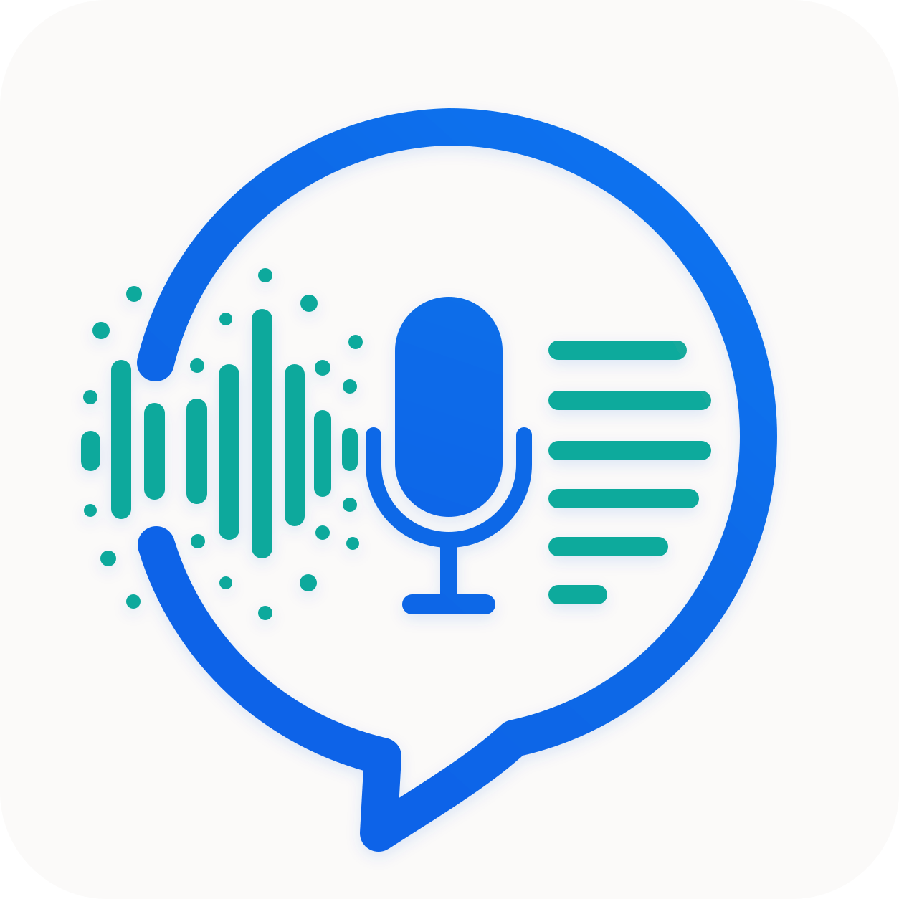
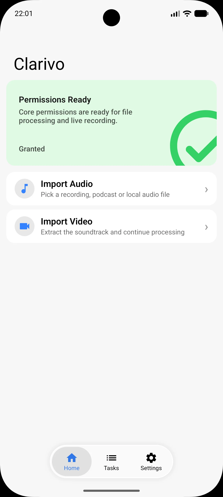
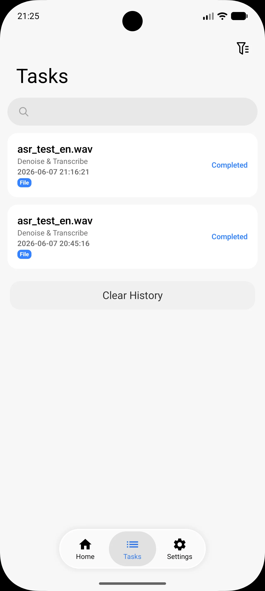
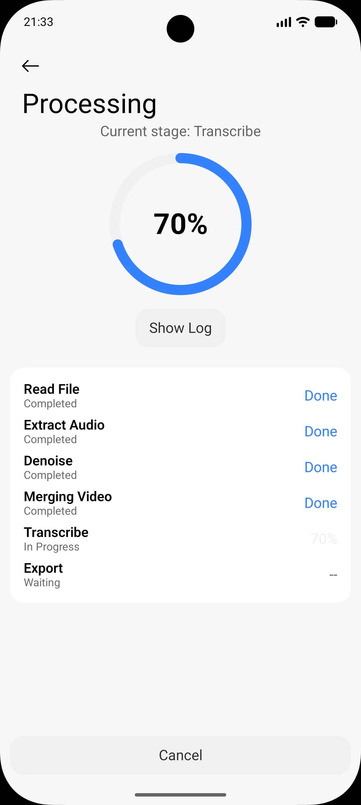
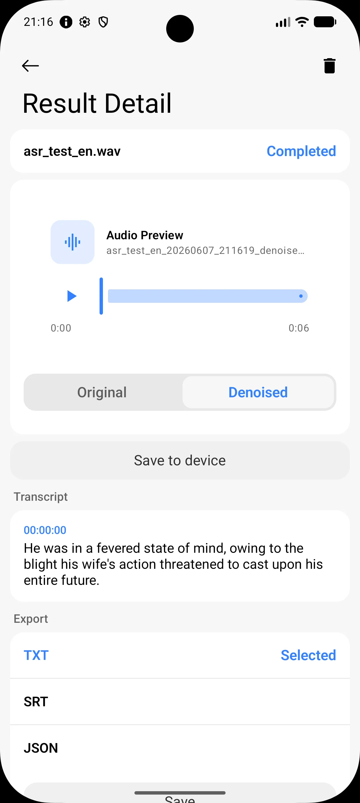
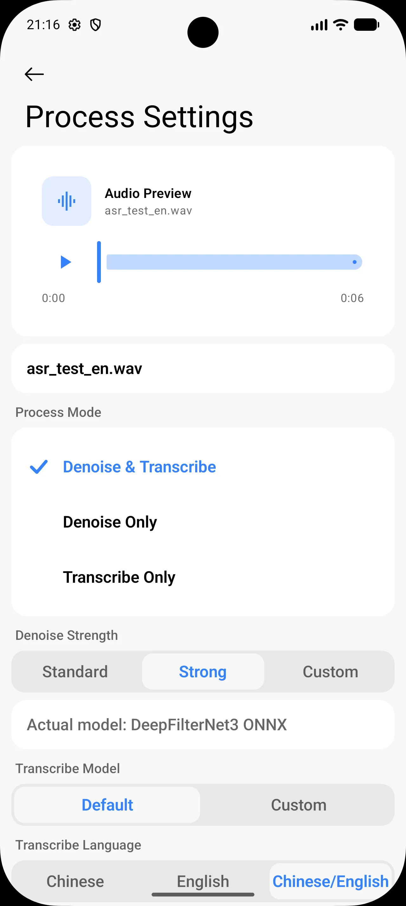
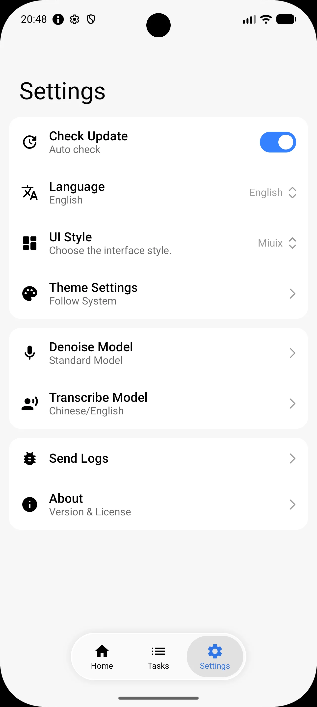

# FVoice / 清声

**Local audio denoising and speech-to-text on Android**

Clean noise, keep voice. All processing runs on-device by default — no cloud upload required.

[Download Latest](https://github.com/chenaizhang/FVoice/releases/latest) · [Issues](https://github.com/chenaizhang/FVoice/issues)

**English** | **[中文](README.md)**

---

> Supports audio/video denoising, transcript, subtitle and shareable exports. Local-first by default.

## Features

| Feature | Description |
|---|---|
| **Audio Denoising** | MP3, WAV, M4A, FLAC, OGG — local model denoising |
| **Video Audio Denoising** | Extract and denoise audio from MP4, MKV, AVI, MOV |
| **Speech-to-Text** | Export TXT, SRT, VTT and structured JSON with full timestamps |
| **VAD Segmentation** | Silero VAD auto-detects speech segments for better long-audio transcription |
| **Real-time Recording** | Microphone recording with auto-save to WAV, then processed in offline queue |
| **Model Management** | Bundled Whisper / DeepFilterNet models, support scanning and switching local model files |
| **Task Queue** | Single-task queue with foreground service, cancellation and crash recovery |
| **Dual Theme** | Miuix and Material3 styles with floating bottom bar, blur effects, predictive back, Monet color extraction and deep customization |

## Screenshots

<table>
  <tr>
    <td></td>
    <td></td>
    <td></td>
  </tr>
  <tr>
    <td align="center">Home</td>
    <td align="center">Task Queue</td>
    <td align="center">Processing</td>
  </tr>
  <tr>
    <td></td>
    <td></td>
    <td></td>
  </tr>
  <tr>
    <td align="center">Transcription Result</td>
    <td align="center">Process Settings</td>
    <td align="center">Settings</td>
  </tr>
</table>

## Requirements

| Item | Requirement |
|---|---|
| OS | Android 8.0+ (API 26) |
| Architecture | arm64-v8a or x86_64 |

## Documentation

| Document | Description |
|---|---|
| [Build Guide](docs/BUILDING_EN.md) | Build APK from source |
| [Third-Party Notices](docs/THIRD_PARTY_NOTICES_EN.md) | Open-source components and licenses |

## Contributing

See [CONTRIBUTING_EN.md](CONTRIBUTING_EN.md) for details.

If you find this project useful, consider giving it a Star to help others discover it!

## Acknowledgements

- [Miuix](https://github.com/miuix-krteam/miuix) — Beautiful Compose UI component library
- [whisper.cpp](https://github.com/ggerganov/whisper.cpp) — High-performance on-device ASR
- [DeepFilterNet](https://github.com/Rikorose/DeepFilterNet) — Real-time speech enhancement
- [Silero VAD](https://github.com/snakers4/silero-vad) — Lightweight voice activity detection
- [ONNX Runtime](https://github.com/microsoft/onnxruntime) — Cross-platform ML inference

## License

This project is licensed under [Apache-2.0](LICENSE). Third-party code retains its original license.
